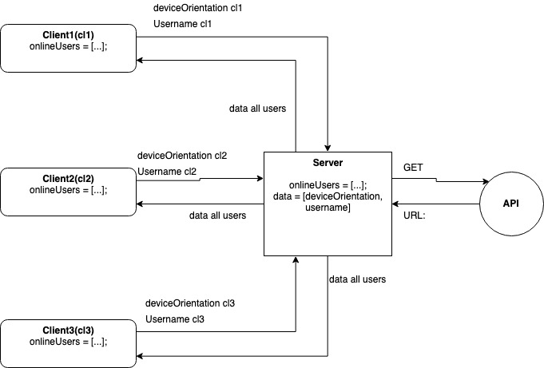

# Real-Time Web @cmda-minor-web · 2018-2019

## Musical Rotation 🎼
[Demo](https://real-time-jesperingels.herokuapp.com/)

*This app only functions well on a smartphone!*

## Install locally 👨‍💻
```
npm i
npm start
```

## Concept 🧩
In this app the user can move a ball around in a box by rotating their smartphone. When the ball touches any side of the 
box, the app will play a musical loop. This app supports multiple users. When the user only touches the right and left side
an API call is done to the [GIPHY API](https://developers.giphy.com/). The .gif file is set as a background for the app. 

## API 📬
The API call to the [GIPHY API](https://developers.giphy.com/) is executed on the server:
```javascript
     rp(api('eyes'))
           .then(res => {
               const info = JSON.parse(res);
               const gif = info.data.map(el => el.images);
               console.log(gif[0].downsized.url);
               io.emit('giphy init', gif[0].downsized.url)
           })
           .catch(function (err) {
               console.log(err);
           });

const api = (msg) => {
    return {
        url:`https://api.giphy.com/v1/gifs/search?q=${msg}&api_key=oz5yAcu5riJVWeOkoR1FAiFegepGemHX&limit=1`,
        headers: {
            'User-Agent': 'request',
            'Content-Type': 'text/html'
        }
    }};
```

I used the npm package [request-promise](https://www.npmjs.com/package/request-promise) to make use of a promise on the server.
The google chrome browser has recently added new safety features which require to add headers to this API call.

It fetches 1 .gif url which is send to all connected clients.

## Data Life Cycle ♽


When the user enters his/her user-name the form POST's the user-name to the server. The user name gets pushed into an array.
The server sends the username back to the client. On the client the received user also gets pushed into an array.

So the server and each client now know which user-names are connected to the server.

When the users' device is rotated, the client sends: the gamma-, beta orientation and username data to the server.
```javascript
window.ondeviceorientation = function (e) {
        let localUserName = window.localStorage.getItem('username');

        let beta = Math.floor(e.beta);
        let gamma = Math.floor(e.gamma);

        let position = {
            beta: beta,
            gamma: gamma
        };

        let userData = [localUserName, position];

        socket.emit('userData', userData);
}
```
On the server a number for the xAxis and yAxis is increased or decreased depending on the device orientation. **Example:**
```javascript
let xAxis = 0;
let yAxis = 0;

socket.on('userData', userData => {
    if(userData[1].gamma < 0) {
        if(xAxis < 270) {
            xAxis += 5;
        }
    }
    else {
        if(xAxis > 0) {
            xAxis -= 5;
        }
    }
    
    //...
    
    io.emit('serverData', serverData);
});
        
```

The username with the xAxis and yAxis is send back to each client. So the client can move each user's ball.

Meanwhile on the server an interval function is monitoring if the ball has hit the left and right wall. If so, an API call
is performed and the data is sent to the clients.


## Dependencies 📦
* Node.js
* EJS
* Express
* Socket.io
* bodyParser

## Wishlist
* More API interactions


<!-- Add a link to your live demo in Github Pages 🌐-->

<!-- ☝️ replace this description with a description of your own work -->

<!-- Add a nice image here at the end of the week, showing off your shiny frontend 📸 -->

<!-- Maybe a table of contents here? 📚 -->

<!-- How about a section that describes how to install this project? 🤓 -->

<!-- ...but how does one use this project? What are its features 🤔 -->

<!-- What external data source is featured in your project and what are its properties 🌠 -->

<!-- This would be a good place for your data life cycle ♻️-->

<!-- Maybe a checklist of done stuff and stuff still on your wishlist? ✅ -->

<!-- How about a license here? 📜 (or is it a licence?) 🤷 -->

[rubric]: https://docs.google.com/spreadsheets/d/e/2PACX-1vSd1I4ma8R5mtVMyrbp6PA2qEInWiOialK9Fr2orD3afUBqOyvTg_JaQZ6-P4YGURI-eA7PoHT8TRge/pubhtml